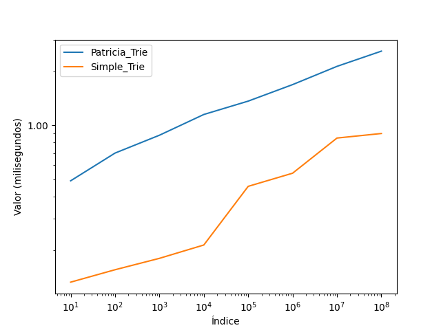

# Alumno: 
1) Chavez Balarezo Fabricio
2) Chambilla Mamani Edgar
3) Lindo Peña Ximena Nicolle
4) Egusquiza Ore Jesus

# Trie

Se le pide implementar lo siguiente:
- Trie en su versión simple para gestionar los hijos (simpletrie.h)
- Trie compacto para gestionar los hijos (patriciatrie.h)

1. Asegúrese que los algoritmos funcionen 
2. Realizar un análisis experimental variando el tamaño del diccionario (N). Para ello debe generar N palabras aleatorias de tamaño variable. 

## Análisis experimental del efecto de compactación en el Trie
| N    | Trie Simple (ms) | Trie Patricia(ms) |
|------|------------------|-------------------|
| 10^1 | 0.0001326        | 0.0004894         |
| 10^2 | 0.0001556        | 0.0006994         |
| 10^3 | 0.0001802        | 0.0008802         |
| 10^4 | 0.000214         | 0.0011498         |
| 10^5 | 0.0004556        | 0.001366          |
| 10^6 | 0.0005396        | 0.0016896         |
| 10^7 | 0.0008488        | 0.0021372         |
| 10^8 | 0.0009           | 0.0026            |

> Gráfico!

## Interpretación de resultados

>Existe una ligera diferencia entre los tiempos de busqueda , como máximo una diferencia de  0.0017 ms. (encontrada
> en la última prueba) en favor del Trie simple , la posible razón de esto se encuentra en la implementación iterativa
> del Simple_Trie y el uso de la recursividad en el Patricia_Trie , si bien ambas busquedas son lineales ,O(m) , donde m es el tamaño
> de la palabra a buscar , la vuelta de la recursion hace que este recorrido se haga una vez más , lo que explica la ligera diferencia de performance.

**Colocar en las celdas el tiempo de computo que se tomaria el algoritmo de búsqueda.**

NOT DELETE OR MODIFY  THE MAIN FILE. 
